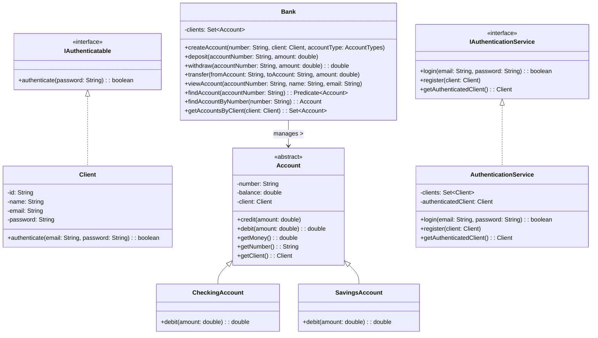

# 💻 Banco Digital

Simulação simples de um sistema bancário digital desenvolvido em Java, utilizando princípios de orientação a objetos. O projeto permite criação de contas, autenticação de clientes, depósitos, saques e transferências — com uma arquitetura limpa baseada em interfaces e serviços. Utiliza **Lombok** para reduzir o código repetitivo e **Mermaid** para o diagrama UML.

---

## 📦 Funcionalidades

- ✅ Criar contas correntes e poupança
- ✅ Registrar e autenticar clientes
- ✅ Realizar depósitos, saques e transferências
- ✅ Acessar contas por filtros usando Stream
- ✅ Arquitetura desacoplada com interfaces e serviços
- ✅ Diagrama UML com Mermaid
- ✅ Uso do Lombok para gerar getters/setters automaticamente

---

## 🧱 Tecnologias

- Java 17+
- Lombok
- API de Collections (Streams, HashSet)
- Mermaid (UML no GitHub)

---

> Certifique-se de ter o [Lombok](https://projectlombok.org/setup/java) corretamente configurado em seu ambiente.

## 📐 Diagrama UML

## 📄 Licença

Este projeto é open-source e está licenciado sob a [MIT License](LICENSE).

---

> Desenvolvido com ☕ por [Lucas Gabriel](https://github.com/luk-z0)
